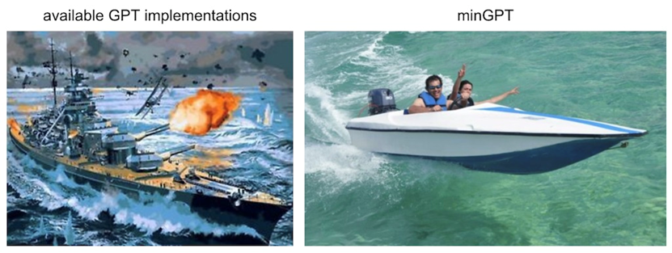
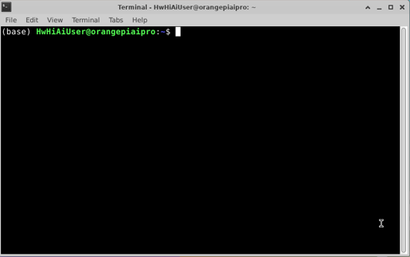
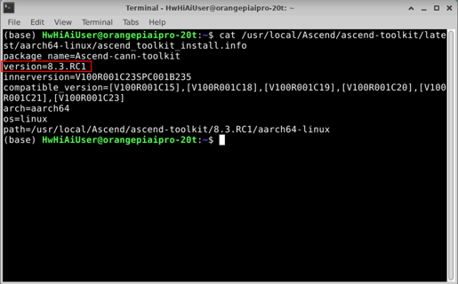
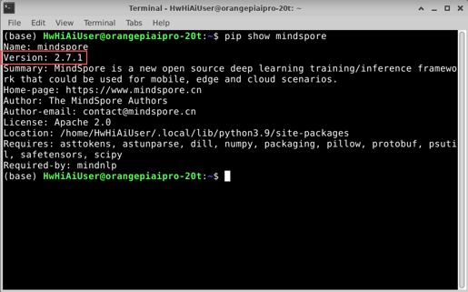
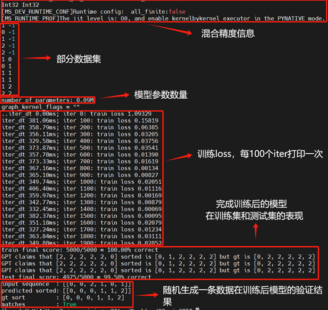

# 项目简介



本项目是将Karpathy的[minGPT项目](https://github.com/mindspore-courses/orange-pi-mindspore/tree/master/Online/training/02-minGPT)迁移至MindSpore框架的实现，包括训练和推理全流程。由于目前大多数可用的GPT模型实现都略显杂乱，minGPT力求小巧、简洁、易懂且具有教育意义。GPT并不是一个复杂的模型，此实现大约有 300 行代码（见mingpt/model.py）。

## 实验环境准备

本章节将介绍如何在OrangePi AIpro-20t上烧录镜像，通过PC远程连接昇腾开发板配置运行环境，并自定义安装CANN和MindSpore。
- 开发板：OrangePi AI pro-20T
- 操作系统镜像：opiaipro_20t_ubuntu22.04_desktop_aarch64_20250211.img.xz 
- Python：3.9
- CANN：8.3RC1 
-  MindSpore：2.7.1

本章节所需的软/硬件如下：

- 硬件：昇腾开发板、PC（个人笔记本电脑）、电源线、HDMI线、显示器、鼠标、键盘、读卡器、USB Type-C 数据线（可选）
- 软件：balenaEtcher制卡工具、Vscode、MobaXterm（可选）

### 镜像烧录

请参考[香橙派环境设置](https://www.mindspore.cn/tutorials/zh-CN/r2.7.1/orange_pi/environment_setup.html)

OrangePi AIpro-20t规格昇腾开发板镜像下载请看[此链接](http://www.orangepi.cn/html/hardWare/computerAndMicrocontrollers/details/Orange-Pi-AIpro(20T).html)，使用镜像：`opiaipro_20t_ubuntu22.04_desktop_aarch64_20250211.img.xz`


### 版本检测

请按照以下说明分别检测CANN以及MindSpore版本，若不满足要求，请按照[香橙派环境设置](https://www.mindspore.cn/tutorials/zh-CN/r2.7.1/orange_pi/environment_setup.html)说明进行更新。

#### CANN版本查询

步骤1 打开终端，检查“@”符号前是否为“HwHiAiUser”用户。



步骤2 执行以下命令获取版本信息。

```bash
(base) HwHiAiUser@orangepiaipro:~$ cat /usr/local/Ascend/ascend-toolkit/latest/aarch64-linux/ascend_toolkit_install.info
```



若当前CANN版本不满足开发需求，可按照[香橙派环境设置](https://www.mindspore.cn/tutorials/zh-CN/r2.7.1/orange_pi/environment_setup.html)CANN升级附录内容对CANN版本进行升级。

#### MindSpore版本查询

步骤1 打开终端，保持检查“@”符号前是否为“HwHiAiUser”用户。


步骤2 执行如下命令，查询当前MindSpore版本。

```bash
(base) HwHiAiUser@orangepiaipro:~$ pip show mindspore
```



若当前MindSpore版本不满足开发需求，可按照[香橙派环境设置](https://www.mindspore.cn/tutorials/zh-CN/r2.7.1/orange_pi/environment_setup.html)MindSpore升级附录内容对MindSpore版本进行升级。

# Quick Start：

## 文件结构介绍

```
02_mingpt/
├── assessments/
│    ├── model-question.py    # GPT网络架构知识点考察代码（填空）
│    └── trainer-question.py  # 混合精度下的训练器知识点考察代码（填空）
├── code
│    ├── mingpt/
│    │    ├── __init__.py     # (package)标志文件
│    │    ├── bpe.py          # 简单的bpe编码器实现
│    │    ├── model.py        # 模型文件，包括attention、transformer_block以及GPT实现
│    │    ├── trainer.py      # 训练器文件，设置了o2模式的混合精度训练
│    │    └── utils.py        # 工具实现
│    ├── demo.py              # GPT-nano数字排序训推全流程
│    ├── generate.py          # 加载预训练模型权重做推理
│    └── run_demo.sh          # 脚本文件，用于自动拉起demo.py的训推
├── docs
│    ├──images/
│    ├── 昇思+昇腾开发板：软硬结合玩转minGPT开发实战.pdf
└──  └──minGPT.md             # minGPT简单的使用文档
```

## 运行demo脚本

请按照以下步骤执行demo脚本：

1. 打开终端进入minGTP文件夹中。

```bash
(base) HwHiAiUser@orangepiaipro:~$ cd 02_mingpt/code
```

2. 使用bash命令运行run_demo.sh脚本

```bash
(base) HwHiAiUser@orangepiaipro:~/minGPT$ bash run_demo.sh
```

3. 若实验验证成功，则会输出以下信息：<br>


## 知识点考察

我们在`02_mingpt/assessments/`路径下设计了两个脚本`model-question.py`和`trainer-question.py`，分别对应了`GPT网络架构知识点考察`和`混合精度下的训练器知识点考察`，考察形式为关键代码挖空的形式，便于开发者更好的学习GPT2的模型架构以及MindSpore下的训推开发流程。

完成两个脚本的代码填空后，开发者先删除`-question`后缀后，用这两个脚本替代`02_mingpt/code/mingpt/`中`model.py`和`trainer.py`脚本进行验证，验证方法参考`运行demo脚本`章节，若运行结果和`运行demo脚本`章节结果一致，则说明代码填空部分正确。


## 自定义模型初始化

demo.py脚本中实现的是gpt2-nano模型，开发者可以通过修改demo.py脚本中模型实例化部分的超参数，
实例化其他规格的gpt2模型，这里以实例化一个GPT-2模型（124M参数版本）为例：

```python
from mingpt.model import GPT
model_config = GPT.get_default_config()
model_config.model_type = 'gpt2'
model_config.vocab_size = 50257 # openai的模型词表长度
model_config.block_size = 1024  # openai的模型输入长度
model = GPT(model_config)
```

## 自定义数据集

demo.py脚本中基于随机生成的数据构建数据集，开发者可以通过修改demo.py脚本中数据集加载部分代码，
加载自己的数据集并训练这个模型，但数据集的加载方式需要使用MindSpore的范式处理：

```python
# 数据集应使用MindSpore的范式处理，详细信息请参考
# https://www.mindspore.cn/tutorials/zh-CN/r2.6.0/beginner/dataset.html
train_dataset = YourDataset()

from mingpt.trainer import Trainer
train_config = Trainer.get_default_config()
train_config.learning_rate = 5e-4 # 学习率
train_config.max_iters = 1000     # 最大迭代次数
train_config.batch_size = 32      # 数据集batch大小
trainer = Trainer(train_config, model, train_dataset)
trainer.run()
```
